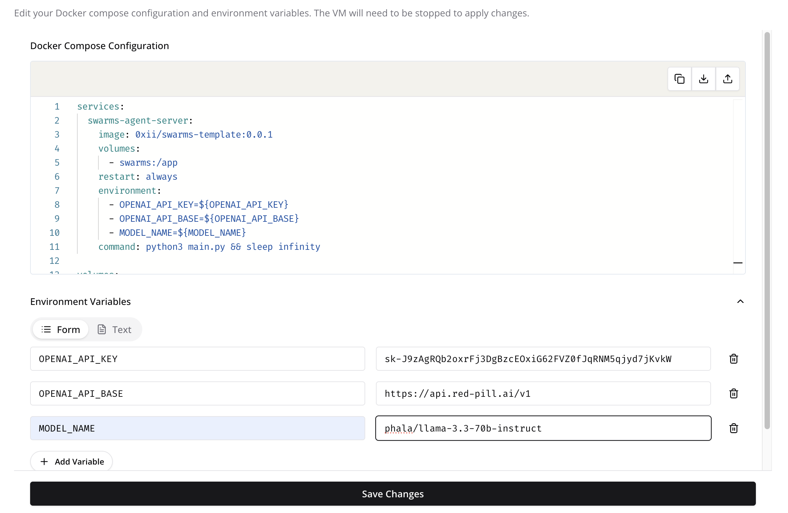

# Swarms 1-Click Template on Phala Cloud


## 🚀 Quick Start

```bash
# Clone the repository
git clone https://github.com/The-Swarm-Corporation/Phala-Deployment-Template

# Install requirements
pip3 install -r requirements.txt

# Set your task in the .env file or pass it in the yaml file on the bottom `task:`
export WORKSPACE_DIR="agent_workspace" 
export OPENAI_API_KEY=""
export OPENAI_API_BASE=""
export MODEL_NAME=""

# Run the swarm
python3 main.py
```


## 🛡️ Running Swarms Agent in Phala TEE

Welcome! This guide will walk you through running your Swarms Agent in a Trusted Execution Environment (TEE) using Phala Cloud. This setup ensures your agent runs in a secure, isolated environment.

### 📋 Prerequisites

- A Swarms Agent code repository (or docker image)
- A Phala Cloud account
- An OpenAI API key

### 📝 Step-by-Step Guide

Firstly, you need to register a [Phala Cloud](https://cloud.phala.network/) account before you can create a new Swarms agent application.

#### 1. ⚙️ Configure Your Environment

First, prepare your `docker-compose.yaml` file. You can find an example in [docker-compose.yaml](./docker-compose.yaml). Make sure to have your OpenAI API key ready.

```yaml
services:
  swarms-agent-server:
    image: 0xii/swarms-template:0.0.1
    volumes:
      - swarms:/app
    restart: always
    environment:
      - OPENAI_API_KEY=${OPENAI_API_KEY}
      - OPENAI_API_BASE=${OPENAI_API_BASE}
      - MODEL_NAME=${MODEL_NAME}

volumes:
  swarms:
```

#### 2. 🚀 Deploy Your Agent

1. Navigate to the [Phala Cloud dashboard](https://cloud.phala.network/dashboard)
2. Click `Deploy` button on the Phala Cloud dashboard.
3. Choose `docker-compose.yaml` and then click `Advanced` tab to paste the content of your docker-compose.yaml file.
4. Importantly, make sure to add the `OPENAI_API_KEY` in the `Encrypted Secrets` section with your own OpenAI API key.
5. Click `Create` button to create a new Swarms agent application.
   <p align="center">
   
   </p>

#### 3. 📊 Monitor Your Deployment

1. Check the initialization logs of your agent
   <p align="center">
   
   
   </p>

2. Verify your container is running
   <p align="center">
   
   </p>

3. Monitor your agent's output
   <p align="center">
   
   </p>

#### 4. ✅ Verify TEE Attestation

Ensure your agent is running in a secure TEE environment by checking the attestation proof on the [TEE Attestation Explorer](https://proof.t16z.com/).

<p align="center">

</p>

### 🎉 Success!

You've successfully deployed your Swarms Agent in a secure TEE environment using Phala Cloud. Your agent is now running in an isolated, trusted execution environment, ensuring enhanced security for your AI operations.

If you have any questions, please reach out to Phala on [Phala Cloud](https://cloud.phala.network/).


## 📬 Contact

Questions? Reach out:
- Phala Cloud:
    - Community: https://github.com/Phala-Network/phala-cloud-community
    - Twitter: [@PhalaNetwork](https://twitter.com/PhalaNetwork)
    - Discord: [Phala Network](https://discord.gg/phala-network)
    - Telegram: [Phala Cloud Tech Discussion](https://t.me/+nbhjx1ADG9EyYmI9)
- Swarms:
    - Twitter: [@kyegomez](https://twitter.com/kyegomez)
    - Email: kye@swarms.world
